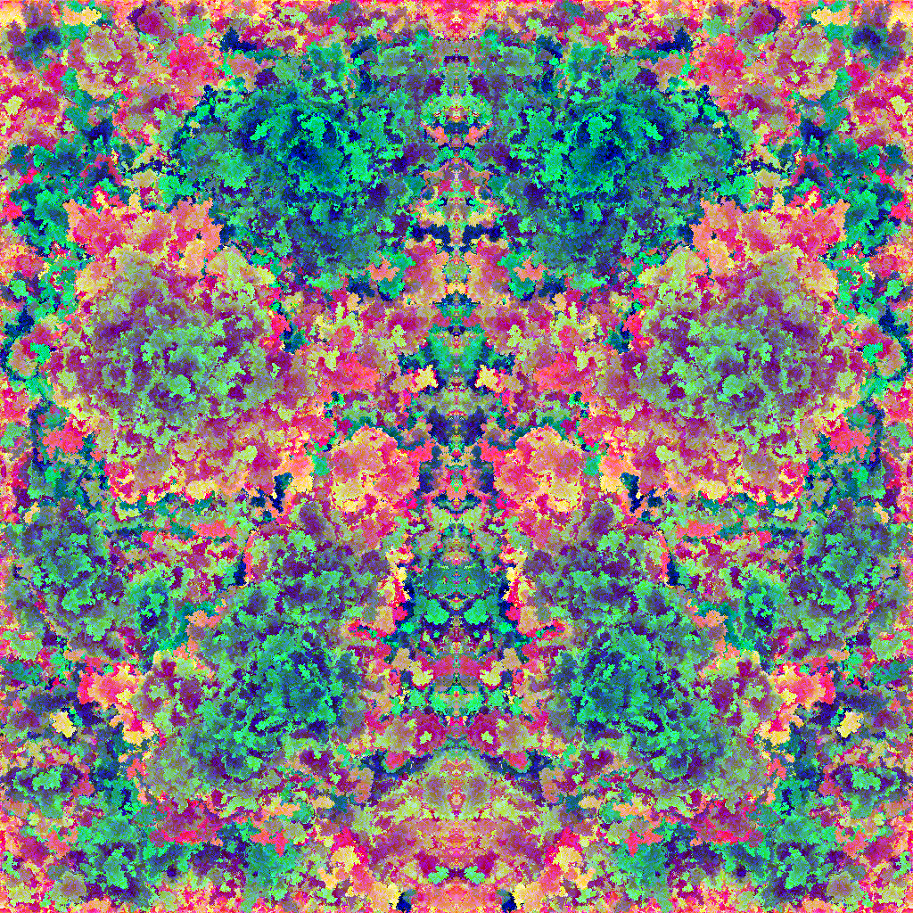

# Colorex

Inspired by [Images with all colors](https://codegolf.stackexchange.com/questions/22144/images-with-all-colors) and [Tweetable Mathematical Art](https://codegolf.stackexchange.com/questions/35569/tweetable-mathematical-art) I decided to make images with a computer.
This was not my [first try](https://github.com/Maumagnaguagno/Spriter), so this time I wanted colorful images for a change.

## Brownian motion
This is the most exciting one, based on [Brownian motion](https://en.wikipedia.org/wiki/Brownian_motion) the computer starts at a random position and moves to a random direction one step, checks if the current position is occupied by a blank pixel and draws a color.
The color is incremented after each successful blank is found, otherwise the process is repeated, with the position being restarted every time the current position is not blank or within the canvas.
Instead of using the full 24 bits [color space](https://en.wikipedia.org/wiki/Color_space) I decided to use 18 bits, 262144 colors, jumping a few visually equal colors along the way to make small images prettier.
Then generating a X mirrored image to result in something like a [Rorschach test](https://en.wikipedia.org/wiki/Rorschach_test) and have some fun seeing the computer testing my sanity.

## Simple formulas
Several cool images can be created by simple formulas that take into account only math functions, the X and Y coordinates and sometimes the canvas width and height.
The following images were created using an R8G8B8 representation, which means 8 bits for each color channel.
The functions used here are from Ruby and the channel values truncated to 8 bits.

### ``[rand(256), rand(256), rand(256)]``
The easiest one is just random noise, for each XY pixel draw any RGB color.

<canvas id=c0 width=1024 height=1024></canvas>

### ``[x * y, 0, 0]``
An alien texture created by multiplication of coordinates on the red channel.

<canvas id=c1 width=1024 height=1024></canvas>

### ``[x * y, y, Math.hypot(x,y).round]``
Slightly more interesting to see than the previous one.
The green channel varies according to Y while the circular effect is created by the hypotenuse.

<canvas id=c2 width=1024 height=1024></canvas>

### ``[x | y, x & y, Math.hypot(x,y).round]``

<canvas id=c3 width=1024 height=1024></canvas>

### ``[x * y, x & y, Math.hypot(x - width / 2, y - height / 2).round]``

<canvas id=c4 width=1024 height=1024></canvas>

### ``[y % 2 == 0 ? x & 1 : x, x & y, x * y]``

<canvas id=c5 width=1024 height=1024></canvas>

### ``[x | y, x & ~y, ~x & y]``

### ``[5 * y, 15 * y, 255 * x / width]``

### ``[r = x == 0 ? 0 : 5 * y % x, 3 * r, 255 * x / width]``
An intermediate value ``r`` is used to avoid division by zero errors.

### ``[r = x.zero? ? 0 : 5 * y % x, 3 * r % 12, 255 * x / width]``
An intermediate value ``r`` is used to avoid division by zero errors.

### ``[(a & b) * 2, (a + b) * 2, (a | b) * 2]``
Two intermediate variables are used, ``a = (x + 1) % (y + 1)`` and ``b = (y + 1) % (x + 1)``

### ``[(r * r * 255).to_i, (g * g * 255).to_i, (b * b * 255).to_i]``
The color wheel uses a little bit more math, with ``PI066 = Math::PI * 2 / 3``, ``a = Math.atan2(y - height / 2, x - width / 2) / 2``, ``r = Math.cos(a)``, ``g = Math.cos(a - PI066)`` and ``b = Math.cos(a + PI066)``.

Eventually I am going to populate this page with more algorithms and pretty images, stay tuned.

